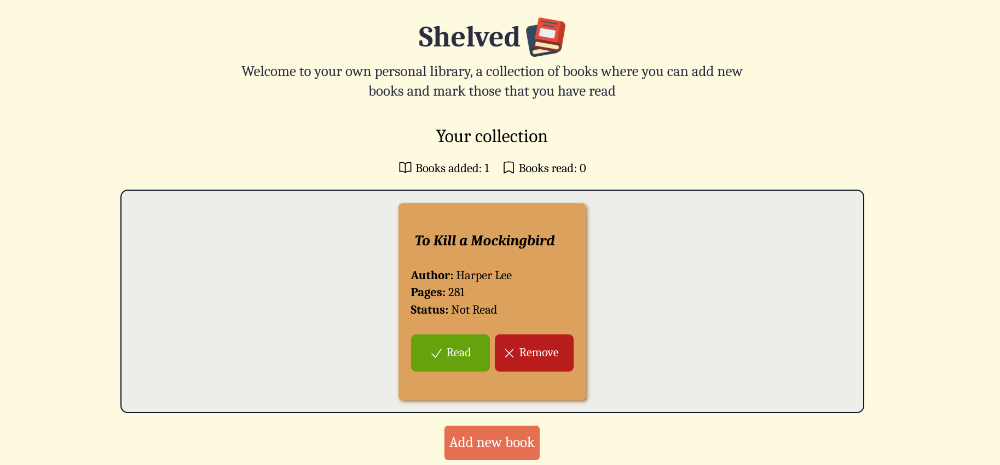

# 📚 Shelved

## Overview
A place to store the books you have read and add new ones you want to read in the future 

Live demo: https://julioapv.github.io/shelved/

## 🚀 **Project Highlights**
- Simple but functional system to store books
- User can add and erase new books
- Users can keep track of how many books they have read and which ones are not read yet
- Intuitive UI for seamless interaction
- Built with object constructors and modular code

## ✨ **Key Features**
1. **Book Management:**
   - Add new books with title, author, and page count
   - Mark books as read/unread with a single click
   - Remove books from your collection
   - Unique ID system for reliable book tracking

2. **Reading Progress Tracking:**
   - Display total number of books in collection
   - Track number of books read
   - Visual status indicators for read/unread books
   - Easy-to-use toggle for reading status

3. **User Interface:**
   - Clean, responsive design
   - Modal form for adding new books
   - Card-based book display
   - Input validation to ensure complete book information

## 🎯 **Learning Objectives**
- Understand DOM manipulation and event handling in JavaScript
- Work with user inputs to dynamically build objects using object prototypes
- Implement dynamic styles and responsiveness using CSS and JavaScript
- Learn how to use modals and dialogs

## 🕹️ **How to Use It**
1. Visit the website through the live demo link
2. View your collection in the main display area
3. Add a new book:
   - Click the "Add new book" button
   - Fill in the book details (title, author, pages)
   - Select whether you've read the book
   - Click "Confirm" to add the book to your collection

4. Manage your books:
   - Toggle read status using the Read/Unread button
   - Remove books using the Remove button
   - Track your reading progress through the counter at the top

5. Book information displayed includes:
   - Title
   - Author
   - Number of pages
   - Reading status

## 🛠️ **Technologies Used**
- **HTML5:** For structuring the application
- **CSS3:** For styling and layout
- **JavaScript (ES6):** For interactivity and functionality
- **Tailwind CSS:** For a modern approach to style webpages

---

Happy reading! :)